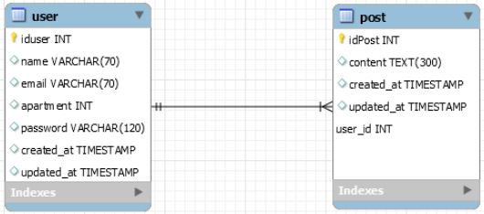

<h1 align=center> Projeto Parrot HandsOn 4 - Grupo 10 </hi>  

  

---

👇 Clique aqui 👇

  

## 💻 Sobre o projeto

 

## FRONT-END
Os desenvolvedores do front-end foram responsáveis por criar as páginas com base no layout utilizando Bootstrap, Styled-components React e Redux.

1. Login
    a. Dados: email e senha
2. Cadastro do Usuário
    a. Dados: Nome, email, senha, unidade/apartamento
3. Feed (criar post, listas todos os posts)
4. Página do usuario (posts do usuário)

## BACK-END
Os desenvolvedores do back-end foram responsáveis por construir a API utilizando TypeScript, Node.js, Express, Jest, Sequelize, MySQL e Arquitetura Limpa.

1. Criação de banco de dados via Migrations e populando via Seeders
2. API Rest com CRUD para usuários e publicações
3. Autenticação de usuário
4. Implementação dos Princípios SOLID na arquitetura
5. Testes automatizados

- Projeto desenvolvido durante o desafio **Hands On 4** oferecido pela **Gama Academy**.

---

## :wrench: Como usar a API:

1. Após clonar o repositório, executar o comando `npm install` ou `yarn install`.
2. Acessar o arquivo `.env example`, renomear o arquivo para `.env` e alterar a conexão do banco de dados com as seguintes instruções:
- DB_HOST="local irá rodar o servidor"
- DB_PORT="porta utilizada pelo mysql"
- DB_USER="nome de usuario no mysql"
- DB_PASS="senha de usuario no mysql"
- DB_NAME="Nome do banco de dados: parrot"
- SECRET_KEY="criar senha interna para jsonwebtoken"

3. Executar o comando `npm run migrations` que irá gerar o banco de dados e popular com exemplos.
4. Executar o comando `npm run debug` para iniciar sua conexão com o servidor
6. Caso tudo tenha dado certo, você está pronto para testar a API, caso não, revise o passo-a-passo

---

## :floppy_disk: Banco de dados

O Banco de Dados foi criado de acordo com o padrão de tabelas e colunas exposto a seguir:  

---
## 🛠 Tecnologias

As seguintes ferramentas foram usadas na construção do projeto:
  

  
  
  
  
  
  
  
  
  
  
  
  
  
  
  
  

---

<h2> 👨‍💻 Contribuidores </h2> 

<h2>
<table align=center>
  <tr>

   <td align="center">  <a href="https://www.linkedin.com/in/fernando-predes-b1545838/"> Fernando Predes - FronEnd</a>           
   </td>
   <td align="center">  <a href="https://www.linkedin.com/in/thiago-daniel-alvim-rodrigues-5229a8124/"> Thiago Rodrigues - BackEnd</a>           
   </td>

  </tr>
</table> </h2>

<h2>
<table align=center>
  <tr>

   <td align="center">  <a href="https://github.com/"> Thais Freire </a>
   </td>
   <td align="center">  <a href="https://github.com/"> Rafael Groetaers </a>
   </td>
    <td align="center">  <a href="https://github.com/"> Amauri Xavier </a>
   </td>
    <td align="center">  <a href="https://github.com/"> Victor Lima Ramos </a>
   </td>

  </tr>
</table> </h2>
